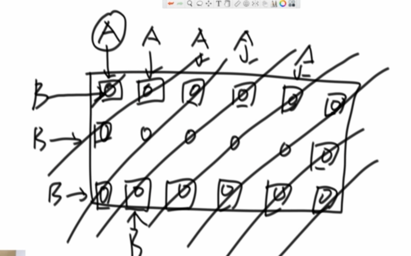
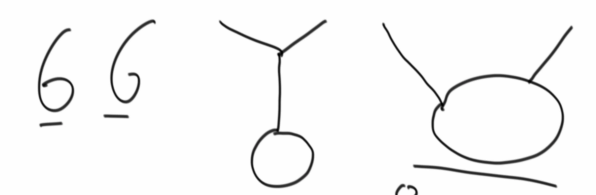

---
## b01
### 冒泡、选择、插入排序
### 复杂度怎么算
### 归并排序，小和问题，逆序对问题

---
## b02
### 快排，随机快排
### 堆排序（建堆，堆化），堆应用：求中位数
### 桶排序：求排序后相邻最大差值
### 排序汇总
- 稳定性  
冒泡、插入 可以做到稳定，选择不行  
归并可以做到，快排、堆排不行
- java库里的综合排序  
长度小于60直接用插排(常数项少，飞快);对基本类型来说,用快排(基本类型无关次序，可以不稳定);自定义的类型用归并 
- 补充 
归并可以做到空间复杂度1，但非常难(归并排序 内部缓存法)；快排可以做到稳定，但非常难(01 stable sort) 
数组奇数左边偶数右边，空间复杂度1，时间复杂度n，不能做到稳定性(除非01 stable sort)
- 桶排序：计数排序，基数排序 
不基于比较的排序，与数据状况有关，应用范围很窄；时间空间复杂度均为n

---
## b03
### 用数组实现栈/队列
### 实现返回最小值的栈
### 栈实现队列，队列实现栈
### 猫狗队列
### 顺时针打印矩阵，顺时针旋转正方形矩阵90度
### 反转链表，反转双向链表
### 之字形打印矩阵

### 在排好序的矩阵中找数
### 判断链表是否回文结构
### 荷兰国旗链表版
### 复制随机链表
### 链表相交系列问题
有环的三种状态

---
## b04
### 二叉树前中后序遍历
### 二叉树后继节点
### 二叉树序列化反序列化
### 判断二叉树是否是平衡二叉树/排序二叉树/完全二叉树
### 已知完全二叉树，求节点个数，时间复杂度低于N

