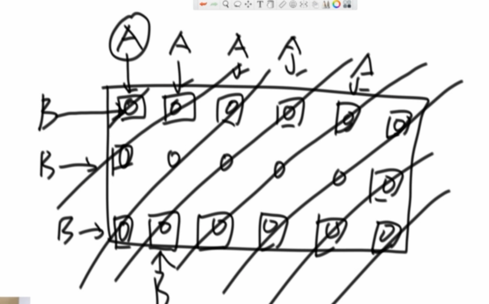
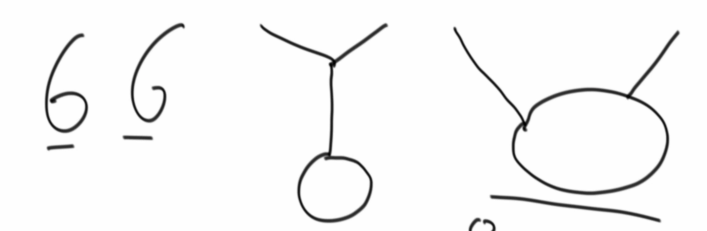
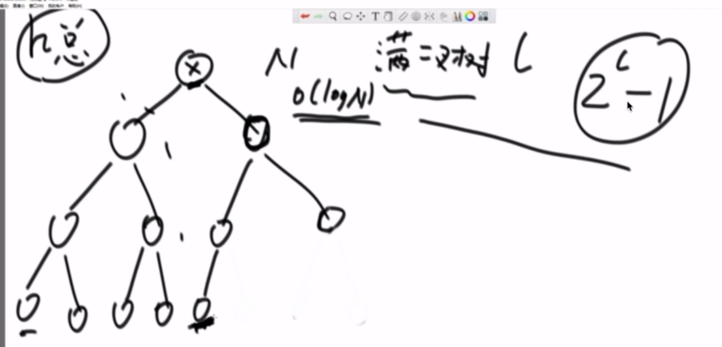
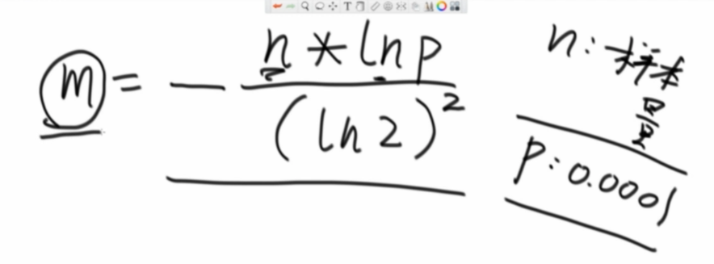
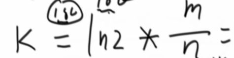
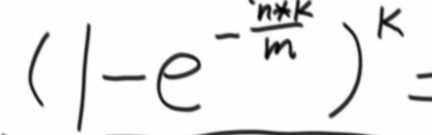
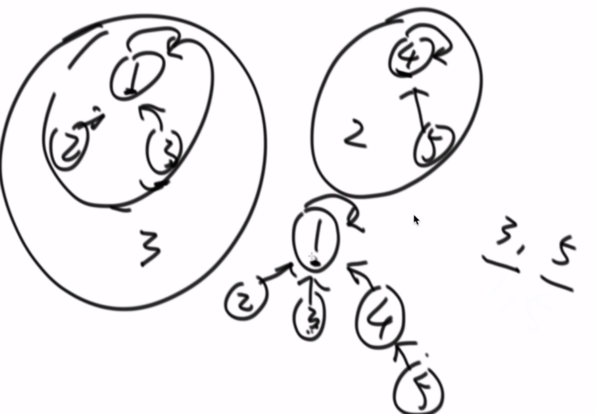
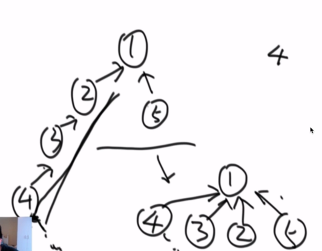
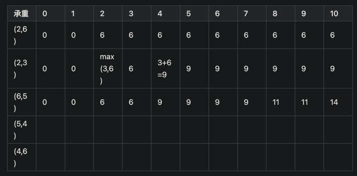

---
## b01
### 冒泡、选择、插入排序
### 复杂度怎么算
### 归并排序，小和问题，逆序对问题

---
## b02
### 快排，随机快排
### 堆排序（建堆，堆化）
### 堆应用：求流的中位数
### 桶排序：求排序后相邻最大差值
### 排序汇总
- 稳定性  
冒泡、插入 可以做到稳定，选择不行  
归并可以做到，快排、堆排不行
- java库里的综合排序  
长度小于60直接用插排(常数项少，飞快);对基本类型来说,用快排(基本类型无关次序，可以不稳定);自定义的类型用归并 
- 补充 
归并可以做到空间复杂度1，但非常难(归并排序 内部缓存法)；快排可以做到稳定，但非常难(01 stable sort) 
数组奇数左边偶数右边，空间复杂度1，时间复杂度n，不能做到稳定性(除非01 stable sort)
- 桶排序：计数排序，基数排序 
不基于比较的排序，与数据状况有关，应用范围很窄；时间空间复杂度均为n

---
## b03
### 用数组实现栈/队列
### 实现返回最小值的栈
### 栈实现队列，队列实现栈
### 猫狗队列
### 顺时针打印矩阵，顺时针旋转正方形矩阵90度
### 反转链表，反转双向链表
### 之字形打印矩阵

### 在排好序的矩阵中找数
### 判断链表是否回文结构
### 荷兰国旗链表版
### 复制随机链表
### 链表相交系列问题
有环的三种状态

---
## b04
### 二叉树前中后序遍历
### 二叉树后继节点
### 二叉树序列化反序列化
### 判断二叉树是否是平衡二叉树/排序二叉树/完全二叉树
### 已知完全二叉树，求节点个数，时间复杂度低于N

---
## b05
### hash表,设计randomPool
input 无穷，output 有穷，散列均匀
###
### 布隆过滤器
用k个hash函数，将每一个hash值对m长度的bit数组取模置为1，可用于黑名单 
下图为m的取值，n为样本量，p为可容忍的失误率 

下图为hash函数个数的公式 

预期失误率计算公式 

### 一致性hash
一个2^64的环，迁移方便；优化：虚拟节点，负载均衡方便
### 并查集

并查集（初始化包含所有数据，不能处理动态流）功能
- 快速查询两个元素是否属于一个集合：多叉树，往上找，看头部是否一样
- 快速把两个集合合并：元素少的头结点指向元素多的头结点
- 优化：查完后路径节点直接指向头结点

查询次数+合并次数逼近O(n)及以上，单次操作时间复杂度平均1
### 岛问题，可用并查集

---
## b06

---
## b07
### 前缀树
### 贪心(都能用堆撸出来)
#### 字符串最小字典序
设计两个字符串拼接后的比较器
#### 最小花费(切金条)
哈夫曼树，用小顶堆，每次出堆两个再将和入堆，所有和加起来就是cost
#### 项目收益分析
先把项目按cost入小顶堆，再把能做的出堆按profit进大顶堆，做大顶堆出堆的项目
#### 会议室安排
按结束时间进小顶堆，依次出堆，能做就做，做不了算逑

---
## b08
### 求n阶乘
### 汉诺塔
### 打印子序列，打印全排列，打印全排列(去重)
### 母牛生仔
### 逆序栈，要求不能申请其他数据结构
父递归反转栈：取栈底，反转剩下的栈(递归)，再将栈底入栈成为栈顶
子递归取栈底：出栈当前值，为栈底直接返回，否则接着取栈底(递归)，然后当前值入栈
### 最小路径和
二维矩阵，从左上角走到右下角，只能向右或向下，求最小路径和
- 暴力递归：   
思路一：从左上角出发，加右边或下边路径和中较小的值  
思路二：到右下角最小路径和肯定包含右下角，由于只能往右或往下走，因此最后一行和最后一列可以推出来，在比较右和下小的值倒推，到0,0点可递归出结果  
- 动态规划：用相同大小矩阵上的每个点代表到该点的最小路径和，可求出第一行和第一列，在推到右下角即可
- 动态规划空间复杂度优化：在得知第一行或第一列后，按行或按列递推即可，此时只用单行或单列即可完成
### 数组累加和
一维数组和一个目标值，求一维数组中的某些数相加是否能得到目标值
- 暴力递归：跟打印子序列很像，从第一个数开始，选择包含与不包含，在最后一个数走完后判断true or false
- 动态规划：初始化矩阵大小 arrLen,aim+1，行下标代表第几个数，列代表上一步的累加和，m[x][aim]肯定是true，最后一行除了aim列全为false  
从最后一行向上推(包括最后一行)，列下标减去当前行数字值的列会为ture(代表加上这个数后为ture)，为true的列上边肯定也为true(代表不加上边这个数)，递推看0,0的值
- 动态规划空间复杂度优化：同上，单行即可优化
### 背包问题
一个重量数组，一个价值数组，一个固定重量背包，要求输出最大值
- 暴力递归：跟打印子序列很像，从第一个数开始，选择包含与不包含，在最后一个物品走完后判断价值
- 动态规划思路1：矩阵大小 itemLen,aim+1，行下标代表第几个物品，列代表重量下拿到该物品后背包最大价值，从下往上推  
列下标加上当前物品重量小于aim+1时，代表物品可拿，除了最后一行，最大值为 当前价值|下一行价值|满足重量条件下当前价值加下一行价值
- 动态规划思路2：矩阵大小 itemLen,aim+1，行下标代表第几个物品，列代表重量；值为当前重量、已考虑过包括小于等于i物品在内下背包问题的解，从上往下推  

- 动态规划空间复杂度优化：同上